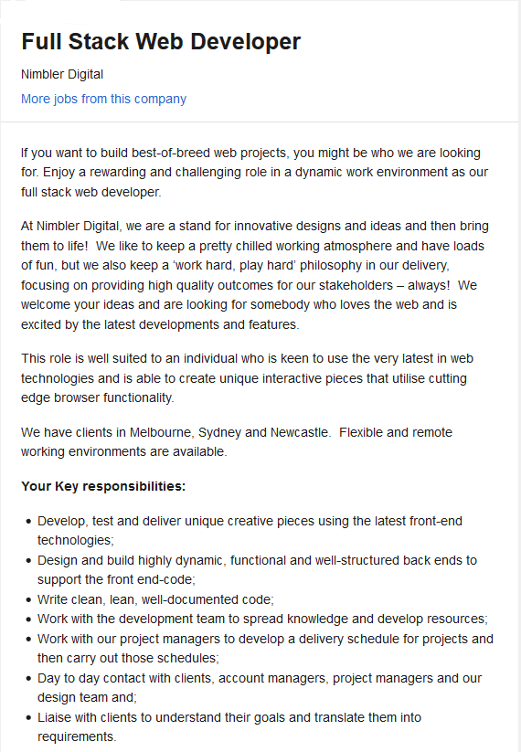
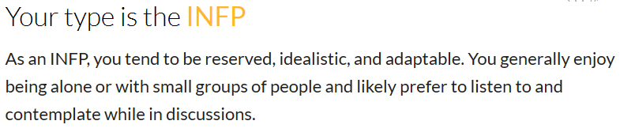
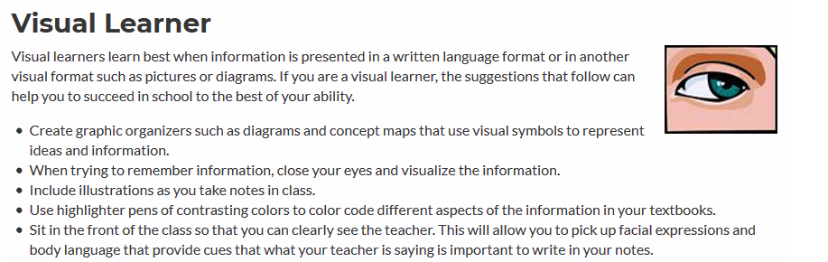
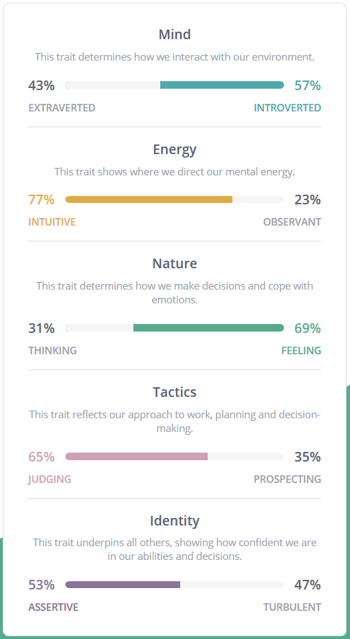

<html>
<title>My Profile</title>
<meta charset="UTF-8">
<meta name="viewport" content="width=device-width, initial-scale=1">
<link rel="stylesheet" href="https://www.w3schools.com/w3css/4/w3.css">
<link rel='stylesheet' href='https://fonts.googleapis.com/css?family=Roboto'>
<link rel="stylesheet" href="https://cdnjs.cloudflare.com/ajax/libs/font-awesome/4.7.0/css/font-awesome.min.css">

<body class="w3-light-grey">

<!-- Page Container -->

  <!-- The Grid -->
  

    <!-- Left Column -->
    

      

        

          
          

              <h2>Steven Jones</h2>
          

        

        

          
<i class="fa fa-briefcase fa-fw w3-margin-right w3-large w3-text-teal"></i>Manufacturing Manager

          
<i class="fa fa-home fa-fw w3-margin-right w3-large w3-text-teal"></i>Shepparton, Vistoria

          
<i class="fa fa-envelope fa-fw w3-margin-right w3-large w3-text-teal"></i>steven.jones@azasel.com

          
<i class="fa fa-phone fa-fw w3-margin-right w3-large w3-text-teal"></i>0423 ### ###

          
<i class="fa fa-star fa-fw w3-margin-right w3-large w3-text-teal"></i>S3549218

          

          
<b><i class="fa fa-asterisk fa-fw w3-margin-right w3-text-teal"></i>Skills</b>

          
HTML

          

            
80%

          

          
CSS

          

            

              
80%

            

          

          
JS, JQ & AJAX

          

            
50%

          

          
PHP

          

            
70%

          

          
SQL

          

            
50%

          

           

          
<b><i class="fa fa-globe fa-fw w3-margin-right w3-text-teal"></i>Languages</b>

          
English

          

            

          

          
French

          

            

          

           
        

      
 

    <!-- End Left Column -->
    

    <!-- Right Column -->
    

      

        <h2 class="w3-text-grey w3-padding-16"><i class="fa fa-certificate fa-fw w3-margin-right w3-xxlarge w3-text-teal"></i><b>My Interest In IT</b></h2>

        

          I have always had an interest in IT as I love the problem-solving aspect of coding especially in real world situations.  Although I had a keen interest, I actually pursued Mechanical and Production engineering in my initial studies, however have always self-taught coding.
          The first spark in coding would have been on my ZX spectrum and coding using basic.  My elder sister was perusing computer programming but gave up and I found myself completing her programs out of fun.

          I have chosen RMIT as it is provided through open universities.  I am a mature student that works full time and can only follow this career through open university.

          I am hoping that the Degree will give me the necessary skills and experience to achieve a career in programming, I would like this to the job I am doing when I retire.

        

      

      

        <h2 class="w3-text-grey w3-padding-16"><i class="fa fa-certificate fa-fw w3-margin-right w3-xxlarge w3-text-teal"></i><b>My Perfect Job</b></h2>
        

          <h3>Full Stack Web Developer</h3>
           <a style="float:left" href="https://www.seek.com.au/job/41186581?type=standout#searchRequestToken=04e75551-8d3a-414d-8843-def51ec5ad46">>>>> LINK TO SEEK ADVERT! <<<<</a>
             
             
I love the comprehensiveness of full stack developers as in not having to specilaise into a single language or technology.
               I also find that WEB programming is more rewarding as it tends to have fatser projects with visual rewards that  maintains satification in the role. 

            
           
A full stack web developer needs to be able to develop both client and server software. In addition to mastering HTML and CSS, he/she also knows how to:

               Program a browser (like using JavaScript, jQuery, Angular, or Vue)
               Program a server (like using PHP, ASP, Python, or Node)
               Program a database (like using SQL, SQLite, or MongoDB)

           

           

          

        

      

      

        <h2 class="w3-text-grey w3-padding-16"><i class="fa fa-certificate fa-fw w3-margin-right w3-xxlarge w3-text-teal"></i><b>Personality Profile</b></h2>
        

          

            <h3>Myers–Briggs Type Indicator Test</h3>
            <a style="float:left" href="https://www.crystalknows.com/myers-briggs-test">>>>> TESTED AT THIS LINK <<<<</a> 
            <h5>Test Results</h5>
            
        

        

          <h3>Learning Style Test</h3>
          <a style="float:left" href="https://www.how-to-study.com/learning-style-assessment/quiz-item.asp">>>>> TESTED AT THIS LINK <<<<</a> 
          <h5>Test Results</h5>
          
        

        

           <h3>16 Personalities Test</h3>
           <a style="float:left" href="https://www.16personalities.com/">>>>> TESTED AT THIS LINK <<<<</a> 
           <h5>Test Results</h5>

           
ADVOCATE ..

           
              
        

  

           
 The results from the Myers-Briggs test was a fairly accurate description of my personality.
             It described that I do not necessarily lead conversation or teams but will consider deeply and provide guidance on conclusion.
             I tend to avoid closing out discussions without solid conclusions.  I do prefer working alone but succeed well in small groups.
             Larger groups I tend to not enjoy but in saying that I do not support large team for most situations as reaching conclusions and making decisions can be overly long and, in some cases, not achieved.
             The results from learning style are interesting.  I would not consider myself a visual learner in terms of literature.  If fact I find literature the most difficult to learn from as I have trouble
             staying focused on text and would always prefer a lecture.  Although I am in agreement with visual in regards to graphs and models so I would
             say a good lecture with graphical diagrams is my optimum medium for learning.

           
The results will not affect my participation within a team.  Teams need a variety of personalities to succeed and a typical INFP is a good anchor as such to ensure sound conclusions are reached. I will
           encourage the use of graphics from the groups if I am not understanding concepts etc.

           
Although I would not greatly adjust my behaviours, my team selection would be affected.  Too many INFP's in a group can slow conversation and fluency of ideas so would ensure that a complimenting
               number of other personalities are included
           

         

        

      

    <!-- End Right Column -->
    

    

      <h2 class="w3-text-grey w3-padding-16"><i class="fa fa-certificate fa-fw w3-margin-right w3-xxlarge w3-text-teal"></i><b>My Project</b></h2>
      

       
          <h4>Overview</h4>
          
 My project proposal is a website site for selling customised pet tags that are laser engraved as per the user/Customers requirements.  The site would allow users/Customers to choose a pet tag style, colour and then proceed to designed the text and graphics with the ability to be able to set position of both to their liking.  The user/Customer shall have a choice of predefined fonts and graphics that they can rotate and move before placing the order.  A final image file shall be sent with the order so that the order can be completed.  The site shall require registration and login prior to any orders being placed.
Orders shall be received and etched using a CO2 laser and then dispatch to user/Customer by mail.

          

          <h4>Motivation</h4>
          
 I currently do not have the experience or portfolio that would be required to be a full stack web developer. The project would be a challenging project that would require the input of multiple languages and technologies.  The final finish product will make a good resume piece.  I have had vast experience with CO2 laser etching machines and would like to utilised this asset.  These machines although costly have significantly reduced in price over the last decade to prices that are affordable for small home business.  Currently there are several AU websites that offer this type of service although prices are particularly high.  I do not see it of great expectations to take a market share given that pets provide and ongoing and constant demand in ID tags.
          

          <h4>Description</h4>
          
 The main feature of the website would be;

          <ul>
            <li><b>Website general construction</b> </li>
              The main website shall be constructed as one-page website using HTML, PHP and Bootstrap as the main languages and technologies.  Various templates may be reviewed to reduce the programming time and allow a greater focus on the custom graphics feature.  The text editor used for coding shall be Atom, Atom has a great module to link with GIT to work collaborate and control version.
            <li><b>User accounts and login</b></li>
              This feature shall not restrict the general browsing of the site shall be permitted unregistered traffic to even have access to design the tags.  To move to an order the user/Customer shall need to have a registered account or sign up before proceeding.  User accounts shall preferably be stored at the server in an SQL database wherever the server may reside.  Logging and credential checking shall be completed using JavaScript and AJAX to query the database.
            <li><b>Tag Selection</b> </li>

              Tag selection shall be achieved by life like photos that are designed through the graphic design software, GIMP.  The tag graphics shall be able to be toggled through the selections which shall/may be generated by JavaScript and jQuery.  The tags shall come in 4 main shapes;
              <ul>
                <li>	Bone</li>
                <li>  Paw</li>
                <li>	Star</li>
                <li>	Heart</li>
              </ul>
              And 7 different colours.
          <li><b>	Customise Text</b></li>
            Customised text shall be created and positioned using JSFabrics, a library for JavaScript that has capabilities in creating and positioning text.  The user/customer shall be able to select the number of lines of text (maximum 4 lines) and the desired font style of the text.
          <li><b>	Customise Graphics</b></li>
            Customised graphics shall be designed through the graphic design software, GIMP.  These graphics shall be made available for selection on the site and then positioned using JSFabrics.
          <li><b>	Place Orders</b></li>	This feature shall take the constructed tag, text and graphics then evaluate a price for that particular design.  A fully scaled image of the design shall then be
            forwarded with the order for manufacture.  This feature may be controlled through the purchase model depending on the particular module selected.
          <li><b>Make Payment	</b></li>	This feature shall be a module plugin or 3rd party site for taking payments via credit card or PayPal (others depending on module selected).  Research to be done for a secure plugin.
            The hardware features
          <li><b>CO2 Laser etching machine</b></li>
            Order shall be received with an image of the tag design.  The operator shall be able to load the images to a laser etching template to send to the laser.  The laser shall have the capabilities of etching anodised aluminium tags with text or graphics and multiple tags at a time.
          </ul>

          <h4>Tools and Technologies </h4>
          
 Tool and Technologies required are;
            <ul>
<li>Computer capable of running Atom for programming
<li>Server or host for the site
<li>SQL database or similar available at the server or host
<li>HTML, CSS
<li>PHP
<li>JavaScript (and libraries such as Ajax and jQuery)
<li>JSFabric’s<li>
Open source software which is a powerful JavaScript library that makes working with the HTML5 canvas element easily and efficiently.
<li>GIMP 	-	Graphic design software
<li>Atom 	-	Cross Platform text editor for web designers
<li>GitHub	-	version control system
<li>Open source one-page layout website for manipulation to suit our design.
<li>CO2 laser etching machine</li>
Highly precise instruments used to inscribe, decorate, or make custom logos on acrylic, wood, paper, metals, plastics, and an array of other materials.
<li>	Desktop computer capable of running CAD/CAM software to run the laser etching machine. </li>
<li>CAD/CAM software to send designs to the laser machine.</li>
</ul>

<h4>Skills Required </h4>

 The skills required for this project are as follows;
  <ul>
<li>Graphical design</li>
Graphic design abilities shall be required but only at a beginner level.  The graphics, when completed in the laser cutting process all come out white so no colours are required.  All graphics shall be simple with a fun feel to them so no great details required.
<li>	Coding </li>
Intermediate abilities in HTML, CSS AND PHP shall be required.  Intermediate to advanced abilities in JavaScript and various libraries such as JSFabrics, jQuery, Ajax also including SQL.
<li>	C02 Laser</li>
Advance experience with laser etching machine shall be required.
<li>	CAD/CAM software </li>
Experience at an intermediate level shall be required.
<li>	GIT </li>
Beginner to Intermediate experience in GIT required to work collaboratively as a team.
</ul>

<h4>Outcome </h4>

 If the project is successful, we would have a fully functional website with the ability sell pet tags to the general public.  Backend facilities being an operational C02 laser etching machine that can fulfil customer orders.
  The site shall be a great resume piece showing my experience and capabilities across a multitude of languages and technologies pertaining to the WEB.  This will give potential employers looking for a full stack web developer confidence in my abilities.
  

      

    

  <!-- End Grid -->
  

  <!-- End Page Container -->

<footer class="w3-container w3-teal w3-center w3-margin-top">
  
Find me on social media.

  <i class="fa fa-facebook-official w3-hover-opacity"></i>
  <i class="fa fa-instagram w3-hover-opacity"></i>
  <i class="fa fa-snapchat w3-hover-opacity"></i>
  <i class="fa fa-pinterest-p w3-hover-opacity"></i>
  <i class="fa fa-twitter w3-hover-opacity"></i>
  <i class="fa fa-linkedin w3-hover-opacity"></i>
  
Powered by <a href="https://www.w3schools.com/w3css/default.asp" target="_blank">w3.css</a>

</footer>

</body>
</html>

